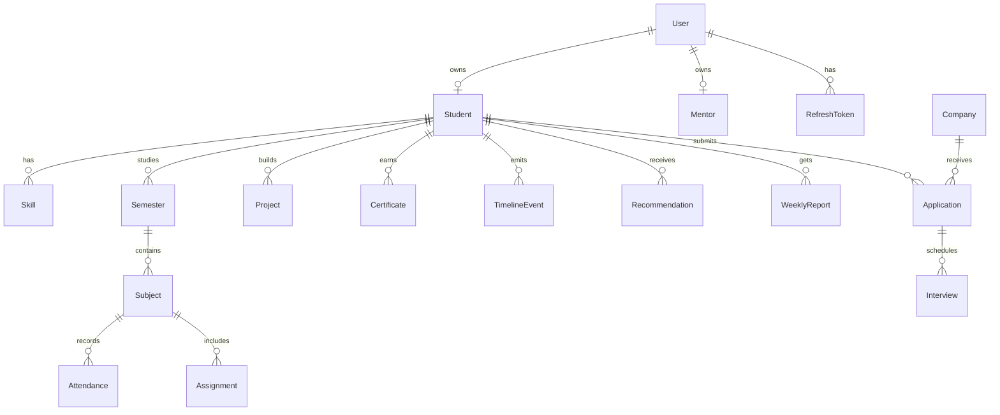

# ER Diagram

```mermaid
erDiagram
  User ||--o| Student : owns
  User ||--o| Mentor : owns
  User ||--o{ RefreshToken : has
  Student ||--o{ Skill : has
  Student ||--o{ Semester : studies
  Semester ||--o{ Subject : contains
  Subject ||--o{ Attendance : records
  Subject ||--o{ Assignment : includes
  Student ||--o{ Project : builds
  Student ||--o{ Certificate : earns
  Student ||--o{ TimelineEvent : emits
  Student ||--o{ Recommendation : receives
  Student ||--o{ WeeklyReport : gets
  Student ||--o{ Application : submits
  Company ||--o{ Application : receives
  Application ||--o{ Interview : schedules
```
